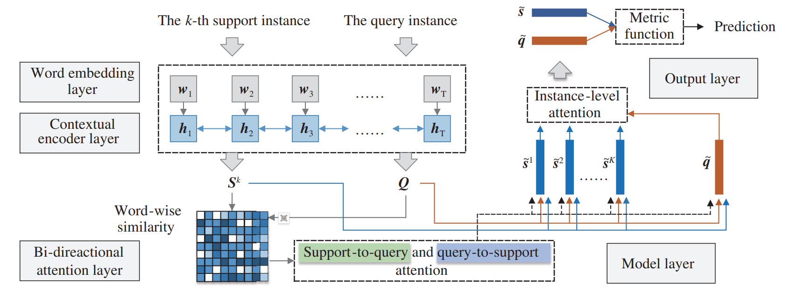

# BACK: Few-shot text classification by leveraging bi-directional attention and cross-class knowledge


This is the implementation coder for [our paper](http://scis.scichina.com/en/2021/130103.pdf) .

## Dependency
```
pytorch
numpy
```

## Data
The benchmark datasets are the same as the baseline [ARR](https://arxiv.org/pdf/1908.06039.pdf), and can be found at [here](https://github.com/YujiaBao/Distributional-Signatures) .
Mainly include Reuters, Huffpost and Fewrel.

## Traning and Eval
Set the hyper-parameter at the argparse in main.py and run it for training and evaluation.

## QA
Please feel free to contact us if any questions. The email address is: pangning14@nudt.edu.cn .

## Citation

If you find our work useful, please kindly cite our paper:

```
@article{DBLP:journals/chinaf/PangZWXG21,
  author       = {Ning Pang and
                  Xiang Zhao and
                  Wei Wang and
                  Weidong Xiao and
                  Deke Guo},
  title        = {Few-shot text classification by leveraging bi-directional attention
                  and cross-class knowledge},
  journal      = {Sci. China Inf. Sci.},
  volume       = {64},
  number       = {3},
  year         = {2021},
  url          = {https://doi.org/10.1007/s11432-020-3055-1},
  doi          = {10.1007/s11432-020-3055-1},
  timestamp    = {Wed, 24 Mar 2021 17:21:20 +0100},
  biburl       = {https://dblp.org/rec/journals/chinaf/PangZWXG21.bib},
  bibsource    = {dblp computer science bibliography, https://dblp.org}
}
```
